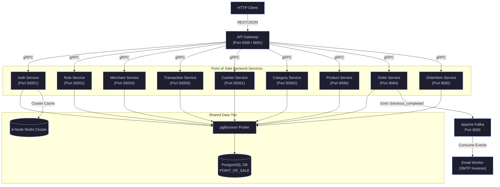
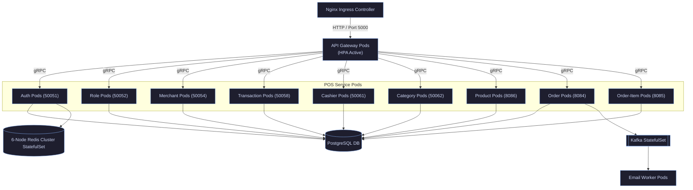
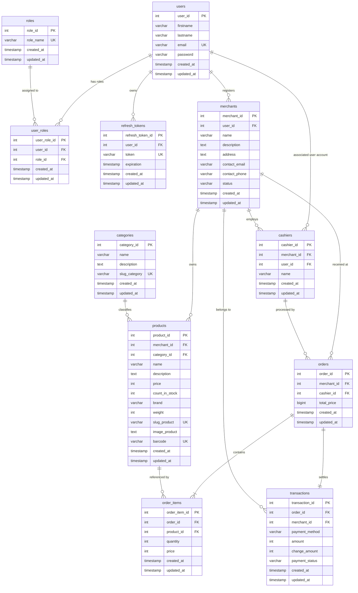

# Distributed Modular Monolith Point Of Sale (Vert.x Java 21)

This project is a high-performance Distributed Modular Monolith implementation of a Point of Sale (POS) system. The core design principle is maintaining strict domain boundaries (authentication, roles, merchants, products, cashiers, orders, transactions, etc.) using the Eclipse Vert.x reactive toolkit in Java 21, while deploying them together as a highly available, sharded distributed cluster.

Each domain module communicates internally using strongly-typed gRPC services and exchanges asynchronous message events via Apache Kafka. This architecture offers the optimal balance of isolated microservice boundaries with the simplicity of coordinated distributed monolithic runtime environments.

---

## Core Features

* **Role-Based Authentication and Authorization**
  * Secured JWT-based token authentication.
  * Granular permission authorization (Admin, Merchant, Cashier).
  * Centralized modular permission validation processed at the API Gateway.

* **Merchant and Cashier Management**
  * Merchant registration, storefront configuration, and business document uploads.
  * Independent cashier management scoped per merchant account.

* **Inventory and Product Management**
  * Full product CRUD capabilities aligned with modular category structures.
  * SKU stock tracking and real-time inventory adjustments.

* **Order and Transaction Processing (CQRS)**
  * POS cart orchestration, checkout flows, and payment calculations.
  * Segregated write-optimized transactions and read-optimized CQRS query mechanisms.
  * Monthly and yearly merchant dashboard aggregation.

* **Reactive & Event-Driven Backbone**
  * Non-blocking gRPC communication for zero-latency internal RPC calls.
  * Asynchronous, event-driven checkout notifications using Apache Kafka.
  * Unified reverse proxy entrypoint using Vert.x Web Gateway.

* **Integrated Observability**
  * Distributed tracing via OpenTelemetry exported to Jaeger.
  * High-fidelity metric aggregation via Prometheus mapped to Grafana dashboards.
  * Centralized log forwarding using Loki.

---

## Active Service Module Directory

The system is structured as 11 active reactive modules running on isolated internal ports:

| Service Name | API Protocol | Internal Port | Host Port | Description |
| :--- | :--- | :--- | :--- | :--- |
| **`apigateway`** | HTTP / REST | `5000` | `8091` | Unified entrypoint gateway routing REST requests to gRPC backend stubs. |
| **`auth`** | gRPC | `50051` | `50051` | Authentication management, JWT lifecycle, and database schema migrations. |
| **`role`** | gRPC | `50052` | `50052` | User authorization rules, permission sets, and role associations. |
| **`merchant`** | gRPC | `50054` | `50054` | Merchant profile registry and verification uploads. |
| **`transaction`** | gRPC | `50058` | `50058` | CQRS transaction ledger and statistical aggregations. |
| **`cashier`** | gRPC | `50061` | `50061` | Cashier profiles and merchant scope allocations. |
| **`category`** | gRPC | `50062` | `50062` | Dynamic category taxonomies for product sorting. |
| **`product`** | gRPC | `8086` | `8086` | Inventory management, SKU catalog, and real-time stock levels. |
| **`order`** | gRPC | `8084` | `8084` | Cart validation, purchase processing, and Kafka checkout events. |
| **`order_item`**| gRPC (Read-Only)| `8085` | `8085` | High-efficiency query-only module for scanning order item records. |
| **`email`** | Kafka Consumer | - | - | Asynchronous invoice processing and email SMTP dispatch. |

---

## Technology Stack

* **Eclipse Vert.x 4.x** - Reactive, event-driven, non-blocking asynchronous Java toolkit.
* **Java 21 (Eclipse Temurin)** - Core programming language environment.
* **gRPC Java & Protobuf v3** - High-speed, low-overhead binary RPC protocol.
* **PostgreSQL 17** - Relational storage backend.
* **Flyway Migration** - Automatic database migrations executing at container startup.
* **Redis 7.4** - Distributed caching clustered layer.
* **Apache Kafka** - Distributed streaming log and message broker.
* **OpenTelemetry, Prometheus, Jaeger, Loki, Grafana** - Full-stack observability framework.
* **Docker & Docker Compose** - Local isolated development topology.
* **Kubernetes** - Production container orchestration.

---

## Deployment Architecture

### 1. Local Compose Topology

In the local environment, services connect to a 6-node local Redis cluster (3 Masters, 3 Replicas) configured with cluster-enabled flag, and database queries are routed through a pgBouncer connection pooling layer:



---

### 2. Kubernetes Production Topology

On Kubernetes, the architecture operates within the `pointofsale` namespace. Horizontal Pod Autoscalers (HPAs) dynamically scale deployments based on resource usage, while pods leverage gRPC TCP probes for health monitoring. Redis is deployed as a sharded StatefulSet:



---

## Local Development Quickstart

### Prerequisites

Ensure the following system tools are installed:
* **Java Development Kit (JDK) 21**
* **Apache Maven 3.9+**
* **Docker & Docker Compose**

### 1. Clone the Repository
```bash
git clone https://github.com/MamangRust/modular-monolith-vertx-point-of-sale.git
cd modular-monolith-vertx-point-of-sale
```

### 2. Compile Java Source Code (Maven Reactor)
Compile the gRPC protobuf files and build the Java binaries:
```bash
mvn clean compile -DskipTests
```

### 3. Build Docker Images
Use the centralized automated build script to construct all backend container images:
```bash
chmod +x build-docker-images.sh
./build-docker-images.sh
```

### 4. Run the Cluster Using Docker Compose
Launch Postgres, Zookeeper, Kafka, the 6 sharded Redis Cluster nodes, and all 11 Java backend modules in detatched mode:
```bash
docker compose -f deployments/local/docker-compose.yml up -d
```
The Redis cluster will automatically initialize itself upon startup via the helper `redis-cluster-init` container. DB schemas are initialized automatically via Flyway when the `auth` container boots.

### 5. Tear Down Local Cluster
To completely stop all containers and wipe volume states:
```bash
docker compose -f deployments/local/docker-compose.yml down -v
```

---

## Production Kubernetes Orchestration

All deployment manifests are organized inside the `deployments/kubernetes/` directory.

### 1. Setup Namespace and Base Configs
Configure the cluster namespace, secure credentials, and common environment properties:
```bash
kubectl apply -f deployments/kubernetes/namespace.yaml
kubectl apply -f deployments/kubernetes/secrets.yaml
kubectl apply -f deployments/kubernetes/configsmaps.yaml
```

### 2. Deploy Common Infrastructure (PostgreSQL, Kafka, Redis Cluster)
Apply volume claims and launch the database, stream engine, and Redis Cluster StatefulSet:
```bash
# Deploy Postgres
kubectl apply -f deployments/kubernetes/postgres-pvc.yaml
kubectl apply -f deployments/kubernetes/postgres-deployment.yaml
kubectl apply -f deployments/kubernetes/postgres-service.yaml

# Deploy Kafka
kubectl apply -f deployments/kubernetes/kafka-pvc.yaml
kubectl apply -f deployments/kubernetes/kafka-deployment.yaml
kubectl apply -f deployments/kubernetes/kafka-service.yaml

# Deploy Redis Cluster (6 StatefulSet Pods + Services + ConfigMap)
kubectl apply -f deployments/kubernetes/redis-cluster.yaml
kubectl apply -f deployments/kubernetes/redis-cluster-service.yaml

# Run the Redis Cluster Creator Job
kubectl apply -f deployments/kubernetes/redis-cluster-init-job.yaml
```

### 3. Deploy POS Application Services
Deploy all microservices, their corresponding load balancer services, and Horizontal Pod Autoscalers:
```bash
# API Gateway
kubectl apply -f deployments/kubernetes/apigateway-deployments.yaml
kubectl apply -f deployments/kubernetes/apigateway-service.yaml
kubectl apply -f deployments/kubernetes/apigateway-hpa.yaml

# Core Domain Services
kubectl apply -f deployments/kubernetes/auth-deployment.yaml
kubectl apply -f deployments/kubernetes/auth-service.yaml

kubectl apply -f deployments/kubernetes/role-deployment.yaml
kubectl apply -f deployments/kubernetes/role-service.yaml

kubectl apply -f deployments/kubernetes/merchant-deployment.yaml
kubectl apply -f deployments/kubernetes/merchant-service.yaml

kubectl apply -f deployments/kubernetes/transaction-deployment.yaml
kubectl apply -f deployments/kubernetes/transaction-service.yaml

kubectl apply -f deployments/kubernetes/cashier-deployment.yaml
kubectl apply -f deployments/kubernetes/cashier-service.yaml

kubectl apply -f deployments/kubernetes/category-deployment.yaml
kubectl apply -f deployments/kubernetes/category-service.yaml

kubectl apply -f deployments/kubernetes/product-deployment.yaml
kubectl apply -f deployments/kubernetes/product-service.yaml

kubectl apply -f deployments/kubernetes/order-deployment.yaml
kubectl apply -f deployments/kubernetes/order-service.yaml

kubectl apply -f deployments/kubernetes/order_item-deployment.yaml
kubectl apply -f deployments/kubernetes/order_item-service.yaml

# Asynchronous Background Workers
kubectl apply -f deployments/kubernetes/email-deployments.yaml
```

Every service pod is configured with a high-fidelity **gRPC TCP Probe** on the container level. This ensures Kubernetes can proactively capture failures and automatically restart unhealthy containers with zero system downtime.

---

## Database Schema (ERD)

The Point of Sale system uses a unified `POINT_OF_SALE` schema mapping domain entities securely across modules. Below is the relational structure designed for the modular monolith, represented as a native **Mermaid.js Entity-Relationship Diagram**:


