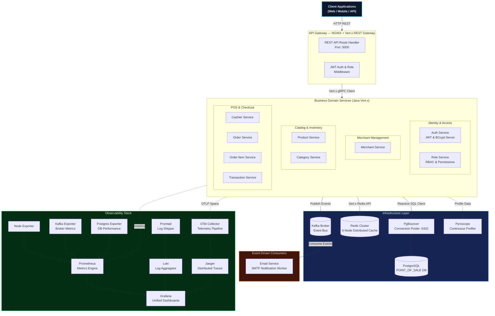
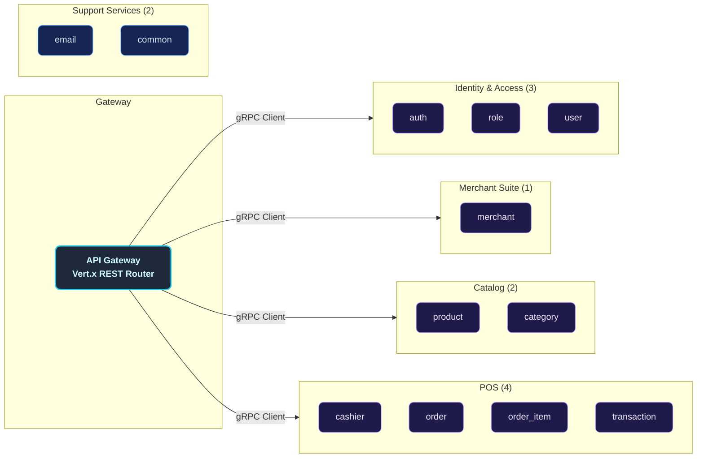
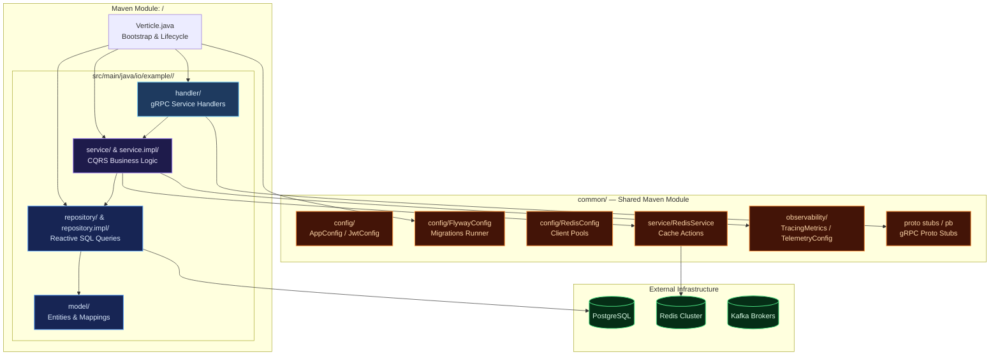
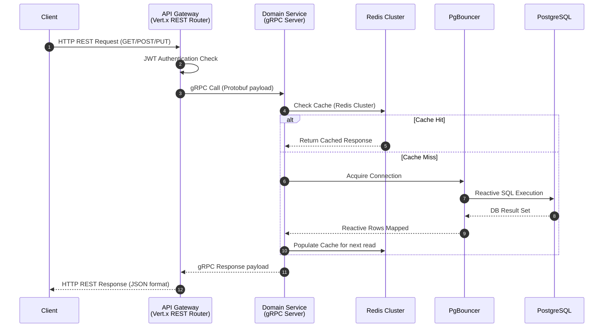
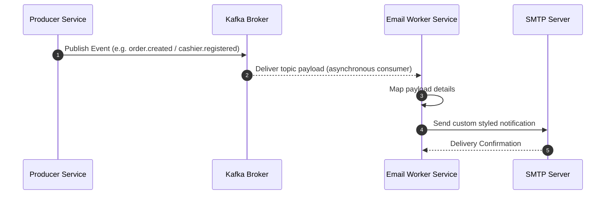
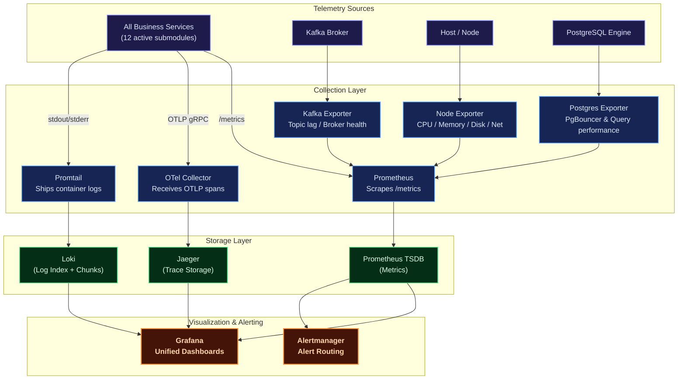
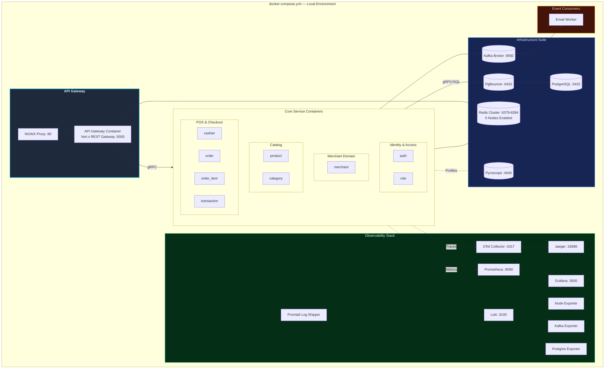

# Distributed Modular Monolith — Point Of Sale (POS) System (Java Vert.x)

A production-grade, highly resilient, and fully observable **modular-monolith point of sale (POS) backend** built in **Java 21** using the **Eclipse Vert.x** reactive framework. Designed around domain-driven service boundaries following Clean Architecture and CQRS principles, it retains the operational and deployment simplicity of a single deployment unit while maintaining logical isolation typical of microservices.

Each point of sale (POS) business domain — Auth, User, Role, Merchant, Cashier, Category, Product, Order, Order Item, and Transaction — lives in its own self-contained Maven module. These modules communicate synchronously via high-performance **gRPC** protocols and asynchronously using **Apache Kafka** event propagation, exposing a unified reactive entry point through a **REST API Gateway** powered by the Eclipse Vert.x HTTP Router.

The platform is fortified with a **comprehensive observability suite** (Prometheus, Grafana, Loki, Jaeger, OpenTelemetry, Pyroscope), robust connection pooling via **PgBouncer**, **distributed Redis Cluster caching** with custom telemetry for each service, and Kubernetes configurations ready for production auto-scaling.

---

## Key Features

| Domain                 | Capabilities                                                                                                                                                                                                                                       |
| :--------------------- | :------------------------------------------------------------------------------------------------------------------------------------------------------------------------------------------------------------------------------------------------- |
| **Auth & Users**       | Secure registration, multi-factor login, stateless JWT access/refresh token lifecycle, password reset workflows, OTP email verification, and `/me` profile REST endpoint.                                                                          |
| **Roles & RBAC**       | Custom permission configuration, granular access control matrices, and sub-second permission evaluation cached via Redis.                                                                                                                          |
| **Catalog & Products** | Full CRUD for products & categories, promo banners, and home slider carousels.                                                                                                                                                                     |
| **Cart & POS**         | Add-to-cart, checkout workflows, order lifecycle management, order-item decomposition, and shipping address details.                                                                                                                               |
| **Merchants**          | Fully featured merchant onboarding, profile details management, business data registration, policies, and merchant awards.                                                                                                                         |
| **Transactions**       | Centralized financial audit ledger collecting transaction and payment events across the system, global search filters, and status tracking.                                                                                                        || **Email Worker**       | Kafka-driven asynchronous worker dispatching critical notification emails (OTPs, login alerts, merchant onboarding notices, and transaction invoices) via SMTP.                                                                                    |
| **Observability**      | Multi-dimensional metrics (Prometheus + Grafana), log aggregation (Loki + Logback), end-to-end distributed tracing (Jaeger + OpenTelemetry), continuous CPU/Memory profiling (Pyroscope), and resource monitors (Node, Kafka, Postgres Exporters). |
| **Deployment**         | Local orchestration using Docker Compose (featuring a 6-node Redis Cluster and PgBouncer), and auto-scaling Kubernetes manifests configured with Horizontal Pod Autoscalers (HPA).                                                                 |

---

## Architecture Overview

The platform implements a **Distributed Modular Monolith** architecture. Each business service is logical, decoupled, and self-contained inside its own Maven submodule, possessing its own independent gRPC boundary. A **Vert.x REST API Gateway** acts as the unified edge router, transforming client HTTP REST requests into fast gRPC downstream communications via Vert.x gRPC clients.

### Core Architecture Principles

- **Domain-Driven Boundary Isolation**: Every service owns its database access, caching layers, and service logic, strictly forbidding cross-boundary database sharing.
- **Clean Architecture & CQRS**: Separation of concerns using `Handler (gRPC) → Service (Command/Query) → Repository (Command/Query)` layers ensures business logic remains clean, performant, and framework-agnostic.
- **Reactive execution**: Powered entirely by the non-blocking Eclipse Vert.x event loop, enabling high throughput with minimal resource footprints.
- **PgBouncer Pooling**: Employs connection pooling to avoid PostgreSQL socket exhaustion across the multiple concurrent modular services.
- **Event-Driven Resilience**: Apache Kafka decouples transaction events, ensuring side effects like email billing remain completely non-blocking.
- **OTel Telemetry Integration**: Standardized OpenTelemetry middleware injects trace IDs across gRPC boundaries, allowing seamless trace propagation from the client REST gateway down to postgres operations.


```mermaid
graph TB
    classDef client fill:#0f172a,stroke:#38bdf8,color:#e0f2fe,stroke-width:2px,font-weight:bold
    classDef gateway fill:#1e293b,stroke:#22d3ee,color:#cffafe,stroke-width:2px,font-weight:bold
    classDef domain fill:#1e1b4b,stroke:#818cf8,color:#e0e7ff,stroke-width:1.5px
    classDef infra fill:#172554,stroke:#60a5fa,color:#dbeafe,stroke-width:1.5px
    classDef obs fill:#052e16,stroke:#4ade80,color:#dcfce7,stroke-width:1.5px
    classDef event fill:#431407,stroke:#fb923c,color:#fed7aa,stroke-width:1.5px

    Client["Client Applications<br/>(Web / Mobile / API)"]:::client

    subgraph APIGateway["API Gateway — NGINX + Vert.x REST Gateway"]
        direction LR
        REST["REST API Route Handler<br/>Port :5000"]
        AuthMW["JWT Auth & Role<br/>Middleware"]
    end
    class APIGateway gateway

    Client -->|HTTP REST| APIGateway

    subgraph BusinessServices["Business Domain Services (Java Vert.x)"]
        direction TB

        subgraph IdentityDomain["Identity & Access"]
            AUTH["Auth Service<br/>JWT & BCrypt Server"]
            ROLE["Role Service<br/>RBAC & Permissions"]
        end

        subgraph MerchantDomain["Merchant Management"]
            MERCH["Merchant Service"]
        end

        subgraph CatalogDomain["Catalog & Inventory"]
            PROD["Product Service"]
            CAT["Category Service"]
        end

        subgraph POSDomain["POS & Checkout"]
            CASHIER["Cashier Service"]
            ORDER["Order Service"]
            OITEM["Order Item Service"]
            TXN["Transaction Service"]
        end
    end
    class BusinessServices domain

    APIGateway -->|"Vert.x gRPC Client"| BusinessServices

    subgraph Infrastructure["Infrastructure Layer"]
        direction LR
        PGBOUNCER["PgBouncer<br/>Connection Pooler :6432"]
        PG[("PostgreSQL<br/>POINT_OF_SALE DB")]
        REDIS[("Redis Cluster<br/>6-Node Distributed Cache")]
        KAFKA[("Kafka Broker<br/>Event Bus")]
        PYRO["Pyroscope<br/>Continuous Profiler"]
    end
    class Infrastructure infra

    BusinessServices -->|"Reactive SQL Client"| PGBOUNCER
    PGBOUNCER --> PG
    BusinessServices -->|"Vert.x Redis API"| REDIS
    BusinessServices -->|"Publish Events"| KAFKA
    BusinessServices -.->|"Profile Data"| PYRO

    subgraph EventConsumers["Event-Driven Consumers"]
        EMAIL["Email Service<br/>SMTP Notification Worker"]
    end
    class EventConsumers event

    KAFKA -->|"Consume Events"| EMAIL

    subgraph Observability["Observability Stack"]
        direction LR
        PROM["Prometheus<br/>Metrics Engine"]
        LOKI["Loki<br/>Log Aggregator"]
        JAEGER["Jaeger<br/>Distributed Traces"]
        GRAFANA["Grafana<br/>Unified Dashboards"]
        OTEL["OTel Collector<br/>Telemetry Pipeline"]
        PROMTAIL["Promtail<br/>Log Shipper"]
        NODEX["Node Exporter"]
        KAFKAX["Kafka Exporter<br/>Broker Metrics"]
        PGX["Postgres Exporter<br/>DB Performance"]
    end
    class Observability obs

    BusinessServices -.->|"/metrics"| PROM
    BusinessServices -.->|"OTLP Spans"| OTEL
    OTEL -.-> JAEGER
    PROMTAIL -.-> LOKI
    NODEX -.-> PROM
    KAFKAX -.-> PROM
    PGX -.-> PROM
    PROM -.-> GRAFANA
    LOKI -.-> GRAFANA
    JAEGER -.-> GRAFANA
```

---

## Service Catalog

The modular architecture consists of **12 runtime services** plus a shared library (`common`) and a one-shot migration runner (`db-migration`):


```mermaid
graph LR
    classDef svc fill:#1e1b4b,stroke:#a78bfa,color:#ede9fe,stroke-width:1px,rx:8
    classDef gw fill:#1e293b,stroke:#22d3ee,color:#cffafe,stroke-width:2px,rx:8,font-weight:bold
    classDef support fill:#172554,stroke:#60a5fa,color:#dbeafe,stroke-width:1px,rx:8

    subgraph Gateway
        API["API Gateway<br/>Vert.x REST Router"]:::gw
    end

    subgraph Identity["Identity & Access (3)"]
        A1["auth"]:::svc
        A2["role"]:::svc
        A3["user"]:::svc
    end

    subgraph Merchant["Merchant Suite (1)"]
        M1["merchant"]:::svc
    end

    subgraph Catalog["Catalog (2)"]
        C1["product"]:::svc
        C2["category"]:::svc
    end

    subgraph POS["POS (4)"]
        O1["cashier"]:::svc
        O2["order"]:::svc
        O3["order_item"]:::svc
        O4["transaction"]:::svc
    end

    subgraph Support["Support Services (2)"]
        S1["email"]:::support
        S2["common"]:::support
    end

    API -->|"gRPC Client"| Identity
    API -->|"gRPC Client"| Merchant
    API -->|"gRPC Client"| Catalog
    API -->|"gRPC Client"| POS
```

---

## Internal Service Architecture

Every logical business service is mapped as a decoupled submodule following structured clean architecture rules.


```mermaid
graph TB
    classDef handler fill:#1e3a5f,stroke:#7dd3fc,color:#e0f2fe,stroke-width:1.5px
    classDef service fill:#1e1b4b,stroke:#a78bfa,color:#ede9fe,stroke-width:1.5px
    classDef repo fill:#172554,stroke:#60a5fa,color:#dbeafe,stroke-width:1.5px
    classDef infra fill:#052e16,stroke:#4ade80,color:#dcfce7,stroke-width:1.5px
    classDef shared fill:#431407,stroke:#fb923c,color:#fed7aa,stroke-width:1.5px

    subgraph Service["Maven Module: <service-name>/"]
        direction TB

        VERTICLE["<ServiceName>Verticle.java<br/>Bootstrap & Lifecycle"]

        subgraph SrcJava["src/main/java/io/example/<service>/"]
            direction TB
            HANDLER["handler/<br/>gRPC Service Handlers"]:::handler
            SVC["service/ & service.impl/<br/>CQRS Business Logic"]:::service
            REPO["repository/ & repository.impl/<br/>Reactive SQL Queries"]:::repo
            MODEL["model/<br/>Entities & Mappings"]:::repo
        end

        VERTICLE --> HANDLER
        VERTICLE --> SVC
        VERTICLE --> REPO
        HANDLER --> SVC
        SVC --> REPO
        REPO --> MODEL
    end

    subgraph SharedLibs["common/ — Shared Maven Module"]
        direction LR
        CONFIG["config/<br/>AppConfig / JwtConfig"]:::shared
        FLYWAY["config/FlywayConfig<br/>Migrations Runner"]:::shared
        REDIS_CFG["config/RedisConfig<br/>Client Pools"]:::shared
        REDIS_SVC["service/RedisService<br/>Cache Actions"]:::shared
        OBS["observability/<br/>TracingMetrics / TelemetryConfig"]:::shared
        PB["proto stubs / pb<br/>gRPC Proto Stubs"]:::shared
    end

    subgraph Infrastructure["External Infrastructure"]
        direction LR
        PGDB[("PostgreSQL")]:::infra
        RCLUSTER[("Redis Cluster")]:::infra
        KAFKA[("Kafka Brokers")]:::infra
    end

    HANDLER --> PB
    SVC --> REDIS_SVC
    SVC --> OBS
    REPO --> PGDB
    REDIS_SVC --> RCLUSTER
    VERTICLE --> FLYWAY
```

---

## Data & Event Flow

### Synchronous Flow (REST Proxy & Cache Read-Through)

All external client API requests go through the REST endpoints defined in the Vert.x API Gateway Router. The API Gateway validates the JWT/API Key, connects with the correct downstream gRPC modular server, checks the Redis Cluster cache, and fetches PostgreSQL through PgBouncer if a cache miss occurs.


```mermaid
sequenceDiagram
    autonumber
    participant C as Client
    participant GW as API Gateway<br/>(Vert.x REST Router)
    participant SVC as Domain Service<br/>(gRPC Server)
    participant REDIS as Redis Cluster
    participant PGB as PgBouncer
    participant DB as PostgreSQL

    C->>GW: HTTP REST Request (GET/POST/PUT)
    GW->>GW: JWT Authentication Check
    GW->>SVC: gRPC Call (Protobuf payload)
    SVC->>REDIS: Check Cache (Redis Cluster)
    alt Cache Hit
        REDIS-->>SVC: Return Cached Response
    else Cache Miss
        SVC->>PGB: Acquire Connection
        PGB->>DB: Reactive SQL Execution
        DB-->>PGB: DB Result Set
        PGB-->>SVC: Reactive Rows Mapped
        SVC->>REDIS: Populate Cache for next read
    end
    SVC-->>GW: gRPC Response payload
    GW-->>C: HTTP REST Response (JSON format)
```

### Asynchronous Flow (Kafka Notification Event pipeline)

High-performance point of sale (POS) actions (like cashier registration, order checkouts, or transaction creations) trigger background notification events published directly to Apache Kafka brokers. The isolated Email service listens to Kafka, maps the events, and contacts SMTP services.


```mermaid
sequenceDiagram
    autonumber
    participant SVC as Producer Service
    participant K as Kafka Broker
    participant EMAIL as Email Worker Service
    participant SMTP as SMTP Server

    SVC->>K: Publish Event (e.g. order.created / cashier.registered)
    K-->>EMAIL: Deliver topic payload (asynchronous consumer)
    EMAIL->>EMAIL: Map payload details
    EMAIL->>SMTP: Send custom styled notification
    SMTP-->>EMAIL: Delivery Confirmation
```

---

## Observability Architecture


```mermaid
graph TB
    classDef service fill:#1e1b4b,stroke:#818cf8,color:#e0e7ff,stroke-width:1.5px
    classDef collector fill:#172554,stroke:#60a5fa,color:#dbeafe,stroke-width:1.5px
    classDef storage fill:#052e16,stroke:#4ade80,color:#dcfce7,stroke-width:1.5px
    classDef viz fill:#431407,stroke:#fb923c,color:#fed7aa,stroke-width:2px,font-weight:bold

    subgraph Sources["Telemetry Sources"]
        direction TB
        SVCS["All Business Services<br/>(12 active submodules)"]:::service
        KAFKA_SRC["Kafka Broker"]:::service
        NODES["Host / Node"]:::service
        DB_SRC["PostgreSQL Engine"]:::service
    end

    subgraph Collectors["Collection Layer"]
        direction TB
        PROM["Prometheus<br/>Scrapes /metrics"]:::collector
        PROMTAIL["Promtail<br/>Ships container logs"]:::collector
        OTEL["OTel Collector<br/>Receives OTLP spans"]:::collector
        NODEX["Node Exporter<br/>CPU / Memory / Disk / Net"]:::collector
        KAFKAX["Kafka Exporter<br/>Topic lag / Broker health"]:::collector
        PGX["Postgres Exporter<br/>PgBouncer & Query performance"]:::collector
    end

    subgraph Storage["Storage Layer"]
        direction TB
        PROM_TSDB["Prometheus TSDB<br/>(Metrics)"]:::storage
        LOKI_STORE["Loki<br/>(Log Index + Chunks)"]:::storage
        JAEGER_STORE["Jaeger<br/>(Trace Storage)"]:::storage
    end

    subgraph Visualization["Visualization & Alerting"]
        GRAFANA["Grafana<br/>Unified Dashboards"]:::viz
        ALERTMGR["Alertmanager<br/>Alert Routing"]:::viz
    end

    SVCS -->|"/metrics"| PROM
    SVCS -->|"OTLP gRPC"| OTEL
    SVCS -->|"stdout/stderr"| PROMTAIL
    NODES --> NODEX
    KAFKA_SRC --> KAFKAX
    DB_SRC --> PGX

    NODEX --> PROM
    KAFKAX --> PROM
    PGX --> PROM
    PROM --> PROM_TSDB
    PROMTAIL --> LOKI_STORE
    OTEL --> JAEGER_STORE

    PROM_TSDB --> GRAFANA
    LOKI_STORE --> GRAFANA
    JAEGER_STORE --> GRAFANA
    PROM_TSDB --> ALERTMGR
```

| Pillar        | Tool                   | Purpose                                                                                         |
| :------------ | :--------------------- | :---------------------------------------------------------------------------------------------- |
| **Metrics**   | Prometheus + Grafana   | Core metrics tracking (CPU, memory, request error rates, gRPC latencies, DB connection states). |
| **Logging**   | Loki + Logback         | Centralized structured JSON logger for indexing logs by service, queryable via LogQL.           |
| **Tracing**   | OpenTelemetry + Jaeger | Distributed system tracing across API gateway and internal gRPC services.                       |
| **Profiling** | Pyroscope              | Continuous memory/CPU profiling to eliminate allocation memory leaks in transaction loops.      |
| **Alerting**  | Alertmanager           | Automated notification system triggered during latency hikes or service disconnects.            |

## Chaos Engineering Platform

The E-Commerce platform features a built-in reactive Chaos Engineering engine to continuously test system resilience under failure conditions (database spikes, SQL lock deadlocks, slow HTTP endpoints, CPU stress, and memory leaks).

The chaos engine is managed by [ChaosManager](./common/src/main/java/io/example/common/chaos/ChaosManager.java) which dynamically watches [chaos.yaml](./chaos.yaml) for modifications:

- **Dynamic Hot-Reloading**: Checks `chaos.yaml` for changes every 5 seconds. Adjusting values or toggling policies will update the running system instantly without requiring a service restart.

For configuration examples see [chaos.yaml](./chaos.yaml); the injection engine lives in [ChaosManager](./common/src/main/java/io/example/common/chaos/ChaosManager.java).

---

## Deployment Architectures

### Docker Compose (Local Development)

The Docker Compose configuration provisions a 6-node Redis Cluster along with databases, event brokers, and reactive service containers to replicate a microservices environment.


```mermaid
flowchart TD
    classDef gateway fill:#1e293b,stroke:#22d3ee,color:#cffafe,stroke-width:2px,font-weight:bold
    classDef core fill:#1e1b4b,stroke:#a78bfa,color:#ede9fe,stroke-width:1.5px
    classDef infra fill:#172554,stroke:#60a5fa,color:#dbeafe,stroke-width:1.5px
    classDef obs fill:#052e16,stroke:#4ade80,color:#dcfce7,stroke-width:1.5px
    classDef event fill:#431407,stroke:#fb923c,color:#fed7aa,stroke-width:1.5px

    subgraph DockerCompose["docker-compose.yml — Local Environment"]

        subgraph Gateway["API Gateway"]
            NGINX["NGINX Proxy :80"]
            APIGW["API Gateway Container<br/>Vert.x REST Gateway :5000"]
        end
        class Gateway gateway

        subgraph Services["Core Service Containers"]
            subgraph Identity["Identity & Access"]
                AUTH["auth"]
                ROLE["role"]
            end

            subgraph MerchantSuite["Merchant Domain"]
                MERCH["merchant"]
            end

            subgraph CatalogSuite["Catalog"]
                PROD["product"]
                CAT["category"]
            end

            subgraph POSSuite["POS & Checkout"]
                CASHIER["cashier"]
                ORDER["order"]
                OITEM["order_item"]
                TXN["transaction"]
            end
        end
        class Services core

        subgraph Infra["Infrastructure Suite"]
            PG[("PostgreSQL :5432")]
            PGB[("PgBouncer :6432")]
            REDIS_CLUSTER[("Redis Cluster :6379-6384<br/>6 Nodes Enabled")]
            KAFKA[("Kafka Broker :9092")]
            PYRO[("Pyroscope :4040")]
        end
        class Infra infra

        subgraph Obs["Observability Stack"]
            PROM["Prometheus :9090"]
            GRAFANA["Grafana :3000"]
            LOKI["Loki :3100"]
            JAEGER["Jaeger :16686"]
            OTEL["OTel Collector :4317"]
            NODEX["Node Exporter"]
            KAFKAX["Kafka Exporter"]
            PGX["Postgres Exporter"]
            PROMTAIL["Promtail Log Shipper"]
        end
        class Obs obs

        subgraph Events["Event Consumers"]
            EMAIL["Email Worker"]
        end
        class Events event
    end

    NGINX --> APIGW
    APIGW -->|"gRPC"| Services
    Services -->|"gRPC/SQL"| PGB
    PGB --> PG
    Services --> KAFKA
    KAFKA --> EMAIL

    Services --> REDIS_CLUSTER
    APIGW --> REDIS_CLUSTER

    Services -.->|"Metrics"| PROM
    Services -.->|"Traces"| OTEL
    Services -.->|"Profiles"| PYRO
    OTEL -.-> JAEGER
    PROMTAIL -.-> LOKI
    PROM -.-> GRAFANA
    LOKI -.-> GRAFANA
```

### ArgoCD App-of-Apps GitOps Architecture

The platform follows GitOps best practices using ArgoCD for declarative continuous deployments. Replicating the App-of-Apps design pattern, a root Application (`pointofsale-root`) automatically manages and tracks the states of individual child Applications mapping to Kustomize bases.

Sync waves (`argocd.argoproj.io/sync-wave` annotations) are strictly defined to guarantee database migrations run and complete before domain applications start.


```mermaid
graph TD
    classDef root fill:#1e293b,stroke:#22d3ee,color:#cffafe,stroke-width:2.5px,font-weight:bold
    classDef proj fill:#0f172a,stroke:#38bdf8,color:#e0f2fe,stroke-width:2px
    classDef app fill:#1e1b4b,stroke:#a78bfa,color:#ede9fe,stroke-width:1.5px
    classDef wave fill:#1c1917,stroke:#f59e0b,color:#fef3c7,stroke-width:1.5px
    classDef base fill:#052e16,stroke:#34d399,color:#dcfce7,stroke-width:1.5px

    RootApp["pointofsale-root<br/>(ArgoCD Root Application)"]:::root
    AppProj["pointofsale<br/>(ArgoCD AppProject)"]:::proj

    RootApp -->|Creates & Tracks| AppProj
    RootApp -->|Deploys Application Manifests| AppIndex["Child Applications List<br/>(deployments/gitops/argocd/apps/)"]:::app

    subgraph SyncWaves["Ordered Deployment Sequencing (Sync Waves 1 - 6)"]
        direction TB

        subgraph Wave1["Wave 1: Namespace & Infrastructure"]
            W1_CM["common"]:::wave
            W1_PG["infra-postgres"]:::wave
            W1_RD["infra-redis"]:::wave
            W1_KF["infra-kafka"]:::wave
        end

        subgraph Wave2["Wave 2: Database Migration"]
            W2_MIG["db-migration"]:::wave
        end

        subgraph Wave3["Wave 3: Core Domain Services"]
            W3_AUTH["service-auth"]:::wave
            W3_USR["service-user"]:::wave
            W3_ROL["service-role"]:::wave
            W3_PROD["service-product"]:::wave
            W3_CAT["service-category"]:::wave
            W3_MER["service-merchant"]:::wave
            W3_ORD["service-order"]:::wave
            W3_CSH["service-cashier"]:::wave
            W3_OIT["service-order-item"]:::wave
            W3_EML["service-email"]:::wave
            W3_OTH["other-domain-services"]:::wave
        end

        subgraph Wave4["Wave 4: Financial Movements"]
            W4_TXN["service-transaction"]:::wave
        end

        subgraph Wave5["Wave 5: Reverse Proxy Gateway"]
            W5_APIGW["apigateway"]:::wave
            W5_NGINX["nginx"]:::wave
        end

        subgraph Wave6["Wave 6: Observability Suite"]
            W6_OBS["service-observability"]:::wave
        end

        Wave1 -->|Triggers next wave| Wave2
        Wave2 -->|Triggers next wave| Wave3
        Wave3 -->|Triggers next wave| Wave4
        Wave4 -->|Triggers next wave| Wave5
        Wave5 -->|Triggers next wave| Wave6
    end

    AppIndex -->|Deploys| Wave1
    AppIndex -->|Deploys| Wave2
    AppIndex -->|Deploys| Wave3
    AppIndex -->|Deploys| Wave4
    AppIndex -->|Deploys| Wave5
    AppIndex -->|Deploys| Wave6

    subgraph K8sBases["Target: Kustomize Base Resources"]
        B_COMMON["deployments/kubernetes/base/common"]:::base
        B_PG["deployments/kubernetes/base/postgres"]:::base
        B_RD["deployments/kubernetes/base/redis"]:::base
        B_KF["deployments/kubernetes/base/kafka"]:::base
        B_MIG["deployments/kubernetes/base/db-migration"]:::base
        B_AUTH["deployments/kubernetes/base/auth"]:::base
        B_USR["deployments/kubernetes/base/user"]:::base
        B_ROL["deployments/kubernetes/base/role"]:::base
        B_PROD["deployments/kubernetes/base/product"]:::base
        B_CAT["deployments/kubernetes/base/category"]:::base
        B_MER["deployments/kubernetes/base/merchant"]:::base
        B_ORD["deployments/kubernetes/base/order"]:::base
        B_CSH["deployments/kubernetes/base/cashier"]:::base
        B_OIT["deployments/kubernetes/base/order_item"]:::base
        B_EML["deployments/kubernetes/base/email"]:::base
        B_TXN["deployments/kubernetes/base/transaction"]:::base
        B_APIGW["deployments/kubernetes/base/apigateway"]:::base
        B_NGINX["deployments/kubernetes/base/nginx"]:::base
        B_OBS["deployments/kubernetes/base/observability"]:::base
    end

    W1_CM -->|Reconciles| B_COMMON
    W1_PG -->|Reconciles| B_PG
    W1_RD -->|Reconciles| B_RD
    W1_KF -->|Reconciles| B_KF
    W2_MIG -->|Reconciles| B_MIG
    W3_AUTH -->|Reconciles| B_AUTH
    W3_USR -->|Reconciles| B_USR
    W3_ROL -->|Reconciles| B_ROL
    W3_PROD -->|Reconciles| B_PROD
    W3_CAT -->|Reconciles| B_CAT
    W3_MER -->|Reconciles| B_MER
    W3_ORD -->|Reconciles| B_ORD
    W3_CSH -->|Reconciles| B_CSH
    W3_OIT -->|Reconciles| B_OIT
    W3_EML -->|Reconciles| B_EML
    W4_TXN -->|Reconciles| B_TXN
    W5_APIGW -->|Reconciles| B_APIGW
    W5_NGINX -->|Reconciles| B_NGINX
    W6_OBS -->|Reconciles| B_OBS
```

---

## Technology Stack

| Category                | Selected Technologies            | Purpose                                                          |
| :---------------------- | :------------------------------- | :--------------------------------------------------------------- |
| **Language**            | Java 21 (Eclipse Vert.x v4.5.24) | Reactive, non-blocking asynchronous Java execution.              |
| **API Edge Gateway**    | Vert.x Web Router                | Reactive REST API Gateway router and reverse proxy destination.  |
| **RPC Inter-service**   | Vert.x gRPC Client & Server      | Blazing fast, contract-first synchronous gRPC communication.     |
| **Database**            | PostgreSQL v17                   | Safe ACID persistent storage system.                             |
| **Database Gateway**    | PgBouncer                        | Extreme-efficiency PostgreSQL socket connection pooler.          |
| **DB Migrations**       | Flyway                           | Incremental database schema version manager run on startup.      |
| **Caching Tier**        | Redis Cluster (6 Nodes)          | Resilient, distributed key-value cache layer.                    |
| **Messaging Stream**    | Apache Kafka                     | Asynchronous high-throughput messaging event bus (KRaft mode).   |
| **Token Manager**       | JWT                              | Secure stateless request authentication standard.                |
| **Observability**       | OpenTelemetry + Jaeger           | Vendor-neutral distributed telemetry pipeline and visualization. |
| **Continuous Profiler** | Pyroscope                        | Real-time memory allocation tracker to identify hot paths.       |
| **Docker Engine**       | Compose                          | Local environment virtualization orchestration.                  |
| **Orchestrator**        | Kubernetes                       | Production-scale auto-scaling pod clustering infrastructure.     |

---

## Getting Started

### Prerequisites

Ensure the following system packages are locally configured:

- [Git](https://git-scm.com/)
- [Java Development Kit (JDK 21+)](https://adoptium.net/)
- [Apache Maven](https://maven.apache.org/) (v3.9+)
- [Docker](https://www.docker.com/) & [Docker Compose](https://docs.docker.com/compose/)
- [Protobuf Compiler](https://grpc.io/docs/protoc-installation/) (optional)

### 1. Clone the Workspace

```sh
git clone https://github.com/MamangRust/modular-monolith-vertx-point-of-sale.git
cd modular-monolith-vertx-point-of-sale
```

### 2. Prepare Environment Configurations

Setup the system configurations from placeholders:

```sh
# Copy environment template (dev defaults; edit secrets before production)
cp docker.env.example docker.env

# docker-compose.yml (deployments/local/) reads ./docker.env from its own
# directory, so keep a copy there as well
cp docker.env deployments/local/docker.env
```

### 3. Build the Maven Project

Compile all submodules and build the executable JAR files:

```sh
mvn clean install
```

### 4. Build Docker Images and Start Environment

Use the included build script to compile the service Docker images, then boot the Docker Compose stack:

```sh
# Build docker images for all services
./build-docker-images.sh

# Start local infrastructure, telemetry containers, and application services
docker compose -f deployments/local/docker-compose.yml up -d
```

Flyway database migrations run via the one-shot `db-migration` container when the stack starts. Set `DB_SEEDER=true` in `docker.env` to also seed the default roles (`ROLE_ADMIN`/`ROLE_CASHIER`/`ROLE_MERCHANT`) and a pre-verified admin user (`admin@example.com` / `Admin@123`).

To verify the cluster services are up and healthy:

```sh
docker compose -f deployments/local/docker-compose.yml ps
```

---

## Port Map Registry

| Application/Service             | Port Configuration / URL                                                        |
| :------------------------------ | :------------------------------------------------------------------------------ |
| **NGINX Reverse Proxy Edge**    | [http://localhost](http://localhost)                                            |
| **API Gateway Direct REST Hub** | [http://localhost:5000](http://localhost:5000)                                  |
| **Grafana Dashboard Portal**    | [http://localhost:3000](http://localhost:3000) _(Credentials: `admin`/`admin`)_ |
| **Prometheus Telemetry**        | [http://localhost:9090](http://localhost:9090)                                  |
| **Jaeger Distributed Tracing**  | [http://localhost:16686](http://localhost:16686)                                |
| **Pyroscope Profiling Panel**   | [http://localhost:4040](http://localhost:4040)                                  |
| **PgBouncer Gateway Node**      | `localhost:6432`                                                                |
| **PostgreSQL Database Engine**  | `localhost:5432`                                                                |

To stop the development system and clean up resources:

```sh
docker compose -f deployments/local/docker-compose.yml down -v
```

---

## Maven & Shell Commands Reference

| Command                                                                    | Scope                                                                                                     |
| :------------------------------------------------------------------------- | :-------------------------------------------------------------------------------------------------------- |
| `mvn clean install`                                                        | Cleans target directories, runs tests, compiles all submodules, and generates package JARs.               |
| `mvn compile`                                                              | Compiles raw Java source files for all modules.                                                           |
| `./build-docker-images.sh`                                                 | Orchestrates the build of Docker images for all Vert.x microservices.                                     |
| `docker compose -f deployments/local/docker-compose.yml up -d`             | Launches all containers (DBs, Redis cluster, Kafka, observability, and Java services) in background mode. |
| `docker compose -f deployments/local/docker-compose.yml down`              | Stops compose containers, releasing standard networks.                                                    |
| `docker compose -f deployments/local/docker-compose.yml logs -f <service>` | Follows the realtime stdout logs of a specific service container.                                         |

---

## Workspace Directory Tree

```
vertx-point_of_sale/
├── pom.xml                         # Root Maven Parent POM (14 modules)
├── docker.env.example              # Environment template (copy → docker.env)
├── chaos.yaml                      # Chaos engineering policies (hot-reloaded)
├── SUPER_PLANNING.md               # Roadmap & gap tracker (source of truth)
├── ERROR_HANDLING_SUMMARY.md       # Error contract documentation
├── common/                         # Shared library: config, observability, chaos, gRPC helpers
│   ├── src/main/proto/             #   Protobuf contracts (api.proto, auth.proto)
│   └── src/main/java/io/example/common/
│       ├── config/                 #   AppConfig, JwtConfig, RedisConfig, FlywayConfig
│       ├── grpc/                   #   GrpcServerBinder, GrpcStatusMapper, TraceContextExtractor
│       ├── observability/          #   TracingMetrics, TelemetryConfig
│       ├── service/                #   RedisService, KafkaService
│       └── chaos/                  #   ChaosManager, interceptors, SqlProxy
├── apigateway/                     # REST API Gateway (REST Router proxying to gRPC)
├── auth/                           # Authentication engine verticle
├── user/                           # User query/command verticle
├── role/                           # RBAC authorization verticle
├── merchant/                       # Merchant core verticle
├── cashier/                        # Cashiers registration & metrics verticle
├── product/                        # Product management verticle
├── category/                       # Category management verticle
├── order/                          # Order management verticle
├── order_item/                     # Order item decomposition verticle
├── transaction/                    # Payment recording verticle
├── email/                          # Asynchronous Kafka notifications verticle
├── db-migration/                   # One-shot Flyway runner (+ optional seeder)
├── deployments/
│   ├── local/                      #   Docker compose infrastructure files
│   ├── kubernetes/                 #   Production K8s manifests
│   └── gitops/                     #   ArgoCD App-of-Apps GitOps manifests
├── observability/                  #   Prometheus/Loki/OTel/Alertmanager + Grafana dashboards
└── nginx/                          #   Reverse-proxy NGINX rules
```

---

## License

This project is open-sourced under the MIT License for educational and development purposes.

---

<p align="center">
  Built with Java, Eclipse Vert.x, gRPC, Apache Kafka, and a passion for high-performance reactive modular monoliths.
</p>
